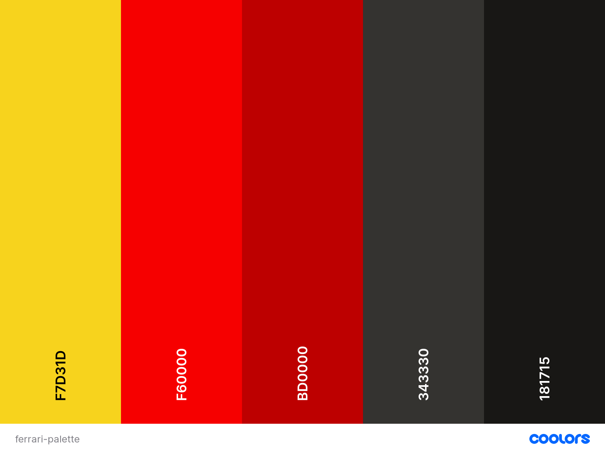
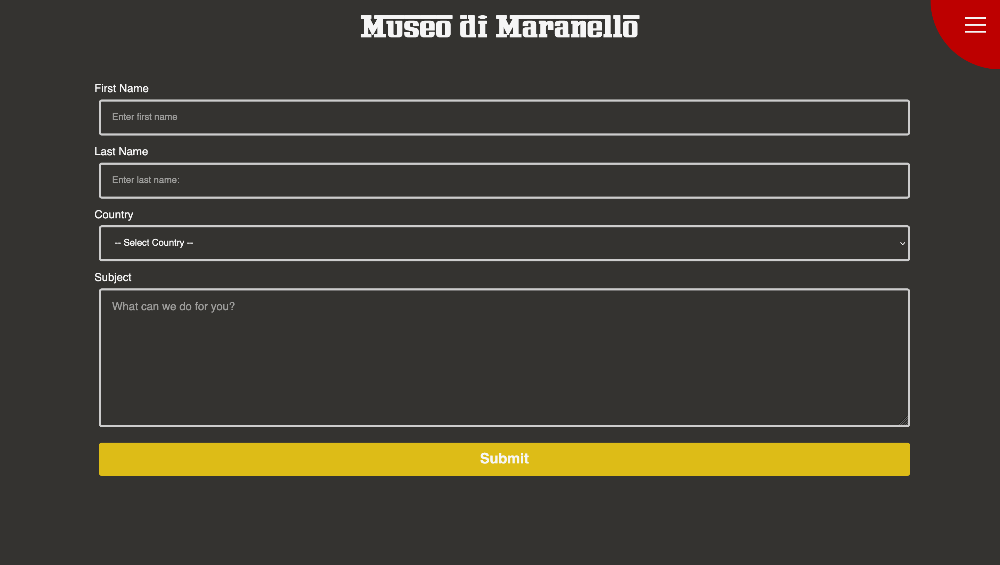

# Museo di Maranello

The Museo di Maranello, or Museum of Maranello in English is an entirely HTML and CSS project designed to showcase the history of some of Ferrari's most memorable and iconic vehicles. Organised by decade, the website has a simple to use navigation though limited content. 

## Design, UI, and UX

In taking inspiration from Ferrari's principal colour schemes - the website was centred around the following colour pallete:

I wanted this site to emulate and capture the feeling of entering a small fan-club with memorabilia across the walls. To capture this, I tried to use first person communication throughout the site as well as 

## Components

* Responsive Hamburger Bar for Site Navigation
    * Hamburger bar with moving animation with ease-in transition that is hidden when not in use. Found in top-right corner. 

* Contact Form
    * Contact form with various text inputs and country selection for all global countries. 

## Testing and Validation

* HTML
* CSS Bugs
    * Scroll-Snapping 
        * Error: Scroll-Snapping could not be used with a track pad but worked with a mouse and keyboard arrows.
        * Solution: Appeared to be an issue with Firefox. Tested on Safari and Chrome and worked as desired. As a safety measure, added a conventional site without scroll-snap and recommended utilisation of keyboard arrows for guided site. 
    * Hamburger Menu Delay
        * Error: The nav menu that would pop up during the expansion of the hamburger menu would appear before the background occupied the full-screen. 
        * Solution: Nav and nav-items given transparent backgrounds. 
    * Nav Bar Links
        * Error 1: The nav items could still be clicked by accident in the background of the welcome section even though users could not see them and should not interact with them.
        * Solution: Changed visibility to hidden so functionality would be turned off unless clicked. 
        * Error 2: When clicking on nav-item, hamburger menu does not automatically close.
        * Solution: Resolved by making <ul></ul> visibility:hidden by default and visible when input:checked.

## References
[Markdown Guide](https://github.com/adam-p/markdown-here/wiki/Markdown-Cheatsheet#links)

[Colour Palette Generator](https://coolors.co)

[Official Ferrari Website - UK](https://www.ferrari.com/en-GB)

[Ferrari Wikipedia](https://en.wikipedia.org/wiki/Ferrari)

[Ferro Rosso Font](https://www.dafont.com/font-comment.php?file=ferro_rosso&text=Museo+di+Maranello)

[Full Page Scroll Tutorial](https://www.youtube.com/watch?v=htw4iKMYzEc)

[Adding Fonts](https://www.geeksforgeeks.org/how-to-include-a-font-ttf-using-css/)

[CSS Variables](https://www.w3schools.com/css/css3_variables.asp)

[Pop-Up/Modal Box](https://www.w3schools.com/howto/howto_css_modals.asp)

[Keyboard Arrow Image](https://www.pngwing.com/en/free-png-pzfjk/download)

[Hamburger Menu](https://alvarotrigo.com/blog/hamburger-menu-css/)

[Grow on Hover](https://travis.media/how-to-make-an-item-grow-on-hover-with-css/)

[Pure CSS Photo Carousel](https://blog.hubspot.com/website/bootstrap-carousel-css)

[Timeline Feature on Home Page](https://www.w3schools.com/howto/howto_css_timeline.asp)

